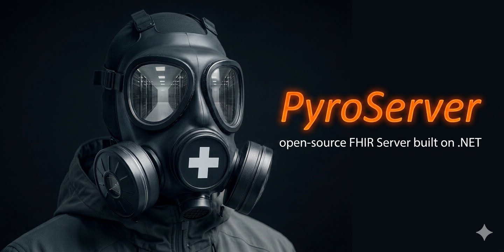

<p align="center">
  
</p>

<p align="center">
  <a href="https://github.com/angusmillar/PyroServer/actions/workflows/ci.yml"></a>
  
  
  
</p>

**PyroServer** is an open-source **FHIR R4 (v4.0.1)** server built on .NET 9. It provides a complete FHIR REST API — comprehensive search, transactions, FHIRPath patch, profile validation, and subscriptions — on a clean, multi-tenant architecture, and is deployed to Azure App Service as a single container.

## Highlights

- **Comprehensive FHIR conformance**  every RESTful interaction (create, read/vread, update, patch, delete, history, search, batch/transaction, `$validate`), each individually toggleable per resource type.
- **Full-featured search engine** - **1,371 search parameters across 134 resource types**, with all standard prefixes and modifiers, arbitrary-depth chaining, reverse chaining (`_has`), composite parameters, and `_include`/`_revinclude`.
- **Complete transaction support**  mixed-verb bundles, same-bundle reference rewriting, and conditional PUT/PATCH/DELETE.
- **Integrated profile validation**  powered by the Firely SDK, applied on write or on demand via `$validate`.
- **Multi-tenancy throughout**  every route is tenant-scoped, resolving its own connection string, cache namespace, and permission policy.
- **Production operations**  hybrid caching, structured logging, health-checked startup, and a migrate-before-deploy CI/CD pipeline.

## FHIR Standard Support

### RESTful interactions

| Interaction | Support |
|---|---|
| CRUD | `Create POST`, `Read GET`, `Update PUT`, `Delete DEL` including conditional create (`e.g If-None-Exist`) |
| History| `GET {type}/{id}/_history/{vid}` |
| Update | `PUT {type}/{id}` (upserts), including conditional update (`PUT {type}?{criteria}`) |
| Patch | FHIRPath Patch — `PATCH {type}/{id}` and conditional `PATCH {type}?{criteria}` |
| Delete | `DELETE {type}/{id}` (idempotent, `204` even if nothing existed), including conditional delete |
| History | Instance, type, and system level (`_history`) |
| Search | Type-level `GET {type}` with the full query engine described below |
| Batch / Transaction | `POST /` with a `Bundle` of type `batch` or `transaction` |
| Capabilities | `GET metadata` — a `CapabilityStatement` generated dynamically from the seeded search parameter catalogue |
| Operations | `$validate` at system, type, and instance level |

All Create/Read/Update/Delete/Search/History/Patch interactions, plus their conditional variants, are individually toggleable per resource type via a permission-matrix policy (`ResourceEndpointPolicies` in `appsettings.json`), so a deployment can expose a read-only tenant alongside a full read/write tenant.

Optimistic concurrency is supported throughout via `ETag`/`If-Match` version checks on read, update, and patch.

### Search

PyroServer ships with all FHIR R4.0.1 default search parameters — **1,371 search parameters spanning 134 FHIR R4 resource types**, generated from the official FHIR definitions and seeded into the database on startup. On top of that catalogue:

- **Custom Search Parameters**  Support for custom search parameters
- **Search prefixes**  all nine standard prefixes: `eq`, `ne`, `gt`, `lt`, `ge`, `le`, `sa`, `eb`, `ap`.
- **Search modifiers**  the full FHIR R4 modifier set: `:missing`, `:exact`, `:contains`, `:not`, `:text`, `:in`, `:not-in`, `:below`, `:above`, `:type`, `:identifier`, `:ofType`.
- **Chained search**  arbitrary-depth forward chaining (`subject.name=Smith`), with resource-type disambiguation (`subject:Patient.family=Smith`) when a reference has multiple possible targets.
- **Reverse chained search (`_has`)**  including nested `_has` chains (`_has:Observation:patient:_has:AuditEvent:entity:user=...`).
- **Composite search parameters**  resolved by combining their component search parameters.
- **_include / _revinclude**  including `:iterate` and `:recurse` modifiers.
- **Result shaping**  `_sort` (ascending/descending on _lastUpdated), `_count`, `_summary`, `_elements`, `_contained`/`_containedType`, and page-based paging with configurable default/maximum page sizes.
- **Common parameters**  `_id`, `_lastUpdated`, `_profile`, `_security`, `_tag` on every resource type.

### Transactions & batches

FHIR Transactions are fully supported, including mixed-verb bundles (POST/PUT/PATCH/DELETE/GET in one transaction), same-bundle reference rewriting and conditional PUT/PATCH/DELETE entries.

### Profile validation

FHIR profile validation is powered by the Firely SDK (`Firely.Fhir.Validation.R4`) and runs automatically on Create, Update, and Patch (toggleable per-deployment via a service setting), as well as on demand via the `$validate` operation at system, type, and instance level.

### Subscriptions

FHIR Subscriptions (`rest-hook` channel) are supported with a background notification manager that polls for matching events every second. 

### Multi-tenancy

Every FHIR route is tenant-scoped (`[base]/{tenant}/{resourceType}/...`), with the tenant resolved from the URL and used to select the correct SQL Server connection string, cache namespace, and endpoint policy for that request.

### Format

Requests and responses use `application/fhir+json`.

## Architecture

- **Mediator pipeline**  every FHIR interaction is an immutable request record dispatched through a mediator pattern, flowing through `CorrelationBehavior` → `LoggingBehavior` → `DatabaseTransactionBehavior` before reaching its handler.
- **Hybrid caching**  [FusionCache](https://github.com/ZiggyCreatures/FusionCache) with an optional Redis backplane caches search parameters, active subscriptions, capability metadata, and service base URLs, with tenant-aware local and distributed TTLs.
- **Indexing**  on write, typed index setters populate dedicated index tables (string, reference, date/time, quantity, token, number, URI) that back the search engine, keeping search fast without scanning stored JSON.
- **EF Core / SQL Server**  resources and search index entries are persisted via Entity Framework Core, with resource and search-parameter JSON payloads GZip-compressed at rest.
- **Startup services**  the server validates its database schema version, primes FHIR service base URLs, and validates/primes resource endpoint policies before it starts accepting traffic.

See [`CLAUDE.md`](./CLAUDE.md) at the repository root for a deeper architectural walkthrough (request lifecycle, validation, exception handling, endpoint policies, CI/CD pipeline, and more).

## Getting started

> **Prerequisites:** .NET 9 SDK, a SQL Server instance (local or Docker), and the EF Core CLI tools.

1. **Clone and restore.** Restore NuGet packages for the solution at `src/Abm.Pyro.sln` (or `src/Abm.Pyro.CI.slnf` if you don't have a .NET Framework 4.8.1 toolchain for `Abm.Pyro.CodeGeneration`).

2. **Point at a database.** Set `ConnectionStrings:PyroDb` in `src/Abm.Pyro.Api/appsettings.Development.json` to a local SQL Server instance, a full local install or a `docker run` of the `mcr.microsoft.com/mssql/server` image both work.

3. **Install the EF Core CLI tools.**
   ```bash
   dotnet tool install --global dotnet-ef
   ```

4. **Apply migrations to create the schema.**
   ```bash
   cd src
   dotnet ef database update --project Abm.Pyro.Repository --startup-project Abm.Pyro.Repository
   ```
   `Abm.Pyro.Repository` is the self-contained EF Core startup project — it carries its own `appsettings.json` and design-time factory, independent of the API project.

5. **Run the API.**
   ```bash
   dotnet run --project src/Abm.Pyro.Api/Abm.Pyro.Api.csproj
   ```
   Swagger UI is available once the server is running, and the capability statement for a tenant is at `GET /{tenant}/metadata`.

To build exactly what the CI pipeline builds:

```bash
dotnet build src/Abm.Pyro.CI.slnf
```

## Testing

Pyro has three test projects, roughly 240 tests in total:

| Project | Scope | Dependencies |
|---|---|---|
| `Abm.Pyro.Domain.Test` | Unit tests for domain logic — index setters, date/time and URI factories, resource-type and HTTP-header support, string/query support | None — pure unit tests |
| `Abm.Pyro.Application.Test` | Unit tests for handlers (Create/Read/Update/Search) and the indexer and FHIRPath Patch service | None — handlers are tested with fakes/mocks |
| `Abm.Pyro.Api.Test` | Full-stack integration tests — CRUD, chained and reverse-chained search, every index type (string/token/date/number/quantity/URI/reference), FHIRPath Patch (direct, conditional, and inside transactions), and transaction/batch Bundle processing | **Docker must be running.** Tests spin up a real `mcr.microsoft.com/mssql/server:2022-latest` container via Testcontainers, apply EF Core migrations against it, and drive the server through `WebApplicationFactory<Program>` with the actual `Hl7.Fhir.Rest.FhirClient`. A single container is shared across the run; [Respawn](https://github.com/jbogard/Respawn) resets resource and index tables between tests |

Run everything (unit + integration):

```bash
dotnet test src/Abm.Pyro.CI.slnf
```

Run a single project:

```bash
dotnet test src/Abm.Pyro.Domain.Test/Abm.Pyro.Domain.Test.csproj
dotnet test src/Abm.Pyro.Application.Test/Abm.Pyro.Application.Test.csproj
dotnet test src/Abm.Pyro.Api.Test/Abm.Pyro.Api.Test.csproj
```

The first run of `Abm.Pyro.Api.Test` will pull the SQL Server image (30–60s cold start); subsequent runs reuse the cached image. If Docker isn't available locally, the two unit test projects still run and cover domain logic and handler behaviour without it.

## Deployment

PyroServer deploys to Azure App Service as a Linux container, built and released via two GitHub Actions workflows:

- **CI** runs on every push to `main`/`development` and every PR into `main`.
- **CD** triggers on pushing a semver tag (`vX.Y.Z`) and runs image build → database migration → deploy, in that order, so the schema is always ready before the new container is served.

See [`CLAUDE.md`](./CLAUDE.md) for the full pipeline, security model, and required App Service configuration.

## Tech stack

| Area | Package(s) |
|---|---|
| FHIR model & REST SDK | [`Hl7.Fhir.R4`](https://www.nuget.org/packages/Hl7.Fhir.R4) 5.11.4 |
| Profile validation | [`Firely.Fhir.Validation.R4`](https://www.nuget.org/packages/Firely.Fhir.Validation.R4) 2.6.3 · `Firely.Fhir.Packages` 4.9.0 |
| Persistence | `Microsoft.EntityFrameworkCore.SqlServer` 9.0.1 |
| Caching | `ZiggyCreatures.FusionCache` 2.0.0 (+ Redis backplane) |
| Logging | `Serilog.AspNetCore` 9.0.0 (Splunk + rolling-file sinks) |
| Config | `Steeltoe.Extensions.Configuration.ConfigServerCore` 3.2.8 (optional, disabled by default) |
| HTTP resilience | `Microsoft.Extensions.Http.Polly` 9.0.1 · `Polly.Contrib.WaitAndRetry` 1.1.1 |
| API docs | `Swashbuckle.AspNetCore` 7.2.0 |
| Application plumbing | `FluentResults` 3.16.0 · `LinqKit.Microsoft.EntityFrameworkCore` 9.0.8 · `NewId` 4.0.1 |

All projects target **.NET 9.0**, except `Abm.Pyro.CodeGeneration`, which targets **.NET Framework 4.8.1** because its T4 templates depend on tooling only available there.
